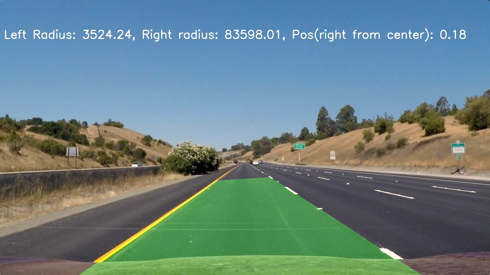

## Writeup

**Advanced Lane Finding Project**

The goals / steps of this project are the following:

* Compute the camera calibration matrix and distortion coefficients given a set of chessboard images.
* Apply a distortion correction to raw images.
* Use color transforms, gradients, etc., to create a thresholded binary image.
* Apply a perspective transform to rectify binary image ("birds-eye view").
* Detect lane pixels and fit to find the lane boundary.
* Determine the curvature of the lane and vehicle position with respect to center.
* Warp the detected lane boundaries back onto the original image.
* Output visual display of the lane boundaries and numerical estimation of lane curvature and vehicle position.


## [Rubric](https://review.udacity.com/#!/rubrics/571/view) Points

### Here I will consider the rubric points individually and describe how I addressed each point in my implementation.  

---


### Camera Calibration

#### 1. Briefly state how you computed the camera matrix and distortion coefficients. Provide an example of a distortion corrected calibration image.


The `object points` and `image points` are created from the chessboard  images.

Chessboard image are having `9x6` grids. So a 9x6 grid is created with each elemnt having (x, y, z) values. `z` value is always zero since we have 2d image.


-  `object points` are like (0, 0, 0), (0, 1, 0), ..., (8, 5, 0).

- `image points` are corners detected by `findChessboardCorners` method of `cv2`.
- `cv2.calibrateCamera(objpoints, imgpoints, gray.shape[::-1], None, None)` is used to get `camera matrix` and `distortion coefficients`.
- We get perspective transformation of the images using `src` and `dest` points. `src` and `dest` points are calculated using `corners` and `margin`.


One example is as below:


**Distorted**


**Undistorted**


### Pipeline (single images)

#### 1. Provide an example of a distortion-corrected image.

Same `object points` and `image points` are used to calibrate camera for lane images as shown below.


**Distorted** 


**Undistorted**


#### 2. Describe how (and identify where in your code) you used color transforms, gradients or other methods to create a thresholded binary image.  Provide an example of a binary image result.


The thresholded images are created in `pipeline` method as shwon below.

```python
def pipeline(img):
    # Convert to HLS color space and separate the S channel
    hls = cv2.cvtColor(img, cv2.COLOR_RGB2HLS)
    s_channel = hls[:,:,2]

    # Grayscale image
    gray = cv2.cvtColor(img, cv2.COLOR_RGB2GRAY)

    # Sobel x
    sobelx = cv2.Sobel(gray, cv2.CV_64F, 1, 0) # Take the derivative in x
    abs_sobelx = np.absolute(sobelx) # Absolute x derivative to accentuate lines away from horizontal
    scaled_sobel = np.uint8(255*abs_sobelx/np.max(abs_sobelx))

    # Threshold x gradient
    thresh_min = 20
    thresh_max = 100
    sxbinary = np.zeros_like(scaled_sobel)
    sxbinary[(scaled_sobel >= thresh_min) & (scaled_sobel <= thresh_max)] = 1

    # Threshold color channel
    s_thresh_min = 170
    s_thresh_max = 255
    s_binary = np.zeros_like(s_channel)
    s_binary[(s_channel >= s_thresh_min) & (s_channel <= s_thresh_max)] = 1

    # Stack each channel to view their individual contributions in green and blue respectively
    # This returns a stack of the two binary images, whose components you can see as different colors
    color_binary = np.dstack(( np.zeros_like(sxbinary), sxbinary, s_binary)) * 255

    # Combine the two binary thresholds
    combined_binary = np.zeros_like(sxbinary)
    combined_binary[(s_binary == 1) | (sxbinary == 1)] = 1

    return color_binary, combined_binary
```


The output is shown below:


#### 3. Describe how (and identify where in your code) you performed a perspective transform and provide an example of a transformed image.

Perspective transformation is described in `perspective` function as shown below.

The warped image is shown in above section 2.

```python
def perspective(img):
    img_size = (img.shape[1], img.shape[0])
    
    src = np.float32([[800, 500], [1100, 680], [300, 680], [555, 500]])
    dst = np.float32([[1150, 380], [1100, 680], [300, 680], [400, 300]])
    
    M = cv2.getPerspectiveTransform(src, dst)
    Minv = cv2.getPerspectiveTransform(dst, src)
    warped = cv2.warpPerspective(img, M, img_size, flags=cv2.INTER_LINEAR)
    return warped, Minv
```

The `src` and `dst` points are hard coded and calculated manually.

|  Source   | Destination |
| :-------: | :---------: |
| 800, 500  |  1150, 380  |
| 1100, 680 |  1100, 680  |
| 300, 680  |  300, 680   |
| 555, 500  |  400, 300   |


The resultant image is as shown below.


#### 4. Describe how (and identify where in your code) you identified lane-line pixels and fit their positions with a polynomial?

The lane line pixels are calculated using sliding window.

- Take histogram of bottom half of the image and find two peaks.

- Calculate window height based on hyperparamters.

- Iterate through window and find `left` and `right` window boundaries.

- Fit a second order polynomial using `left` and `right` lane pixels.


These program is present in `find_lane_pixels` function.

The resultant image is as shown below.


#### 5. Describe how (and identify where in your code) you calculated the radius of curvature of the lane and the position of the vehicle with respect to center.

The radius of curvature is calculated using `left_fit` and `right_fit`  ibtained using `polyfit` function as shown in the function `measure_curvature_real`. The vehicle position is calulcated as middle of two lane lines and then subtracted from center of the image. This gives the vehicle position from the center of the frame.

```python
def measure_curvature_real(binary_warped, left_fit, right_fit):
    '''
    Calculates the curvature of polynomial functions in meters.
    '''
    # Define conversions in x and y from pixels space to meters
    ym_per_pix = 30/700 # meters per pixel in y dimension
    xm_per_pix = 3.7/720 # meters per pixel in x dimension
    
    ploty = np.linspace(0, binary_warped.shape[0]-1, binary_warped.shape[0] )

    
    left_fitx = left_fit[0]*ploty**2 + left_fit[1]*ploty + left_fit[2]
    right_fitx = right_fit[0]*ploty**2 + right_fit[1]*ploty + right_fit[2]
    

    left_fit_cr = np.polyfit(ploty*ym_per_pix, left_fitx*xm_per_pix, 2)
    right_fit_cr = np.polyfit(ploty*ym_per_pix, right_fitx*xm_per_pix, 2)
    
    # Define y-value where we want radius of curvature
    # We'll choose the maximum y-value, corresponding to the bottom of the image
    y_eval = np.max(ploty)

    # Calculation of R_curve (radius of curvature)
    left_curverad = ((1 + (2*left_fit_cr[0]*y_eval*ym_per_pix + left_fit_cr[1])**2)**1.5) / np.absolute(2*left_fit_cr[0])
    right_curverad = ((1 + (2*right_fit_cr[0]*y_eval*ym_per_pix + right_fit_cr[1])**2)**1.5) / np.absolute(2*right_fit_cr[0])
    
     # Calculate vehicle center position
    left_lane_bottom = (left_fit[0]*y_eval)**2 + left_fit[0]*y_eval + left_fit[2]
    right_lane_bottom = (right_fit[0]*y_eval)**2 + right_fit[0]*y_eval + right_fit[2]
    position = ((left_lane_bottom + right_lane_bottom)/2 - 640) * xm_per_pix
    
    return left_curverad, right_curverad, position
```


#### 6. Provide an example image of your result plotted back down onto the road such that the lane area is identified clearly.

The image is as shown below:




---

### Pipeline (video)

#### 1. Provide a link to your final video output.  Your pipeline should perform reasonably well on the entire project video (wobbly lines are ok but no catastrophic failures that would cause the car to drive off the road!).

Here's a [link to my video result](./project_video_output.mp4)

---

### Discussion

#### 1. Briefly discuss any problems / issues you faced in your implementation of this project.  Where will your pipeline likely fail?  What could you do to make it more robust?

- The difficult part for me was to provide a smooth transition of the lane lines where lines are not visible clearly.
- The pipeline might fail when
  - There are no lane lines.
  - The lane lines width are different.
  - The lanes are highly zig-zag.

- This can be made more robust:
  -  Using dynamic range of lane width.
  - Using GPS coordinates.
  - Avoiding manual selection of source destination points for warping.